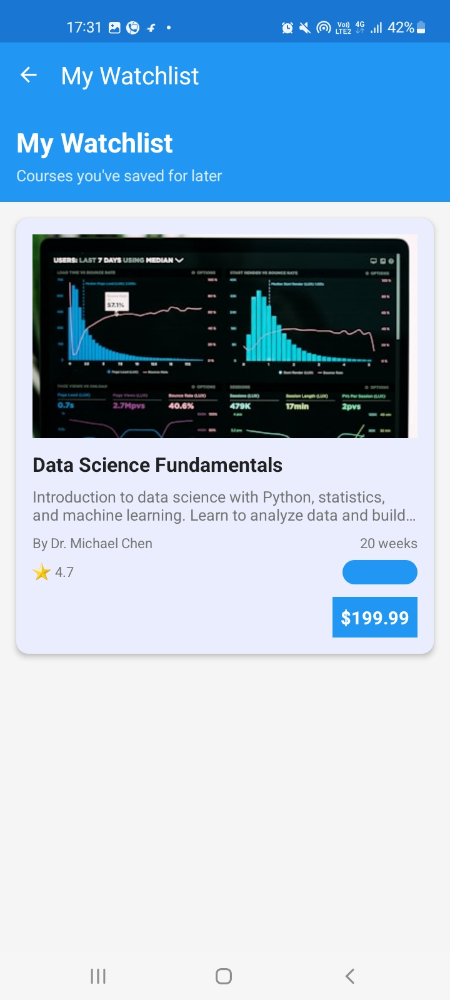
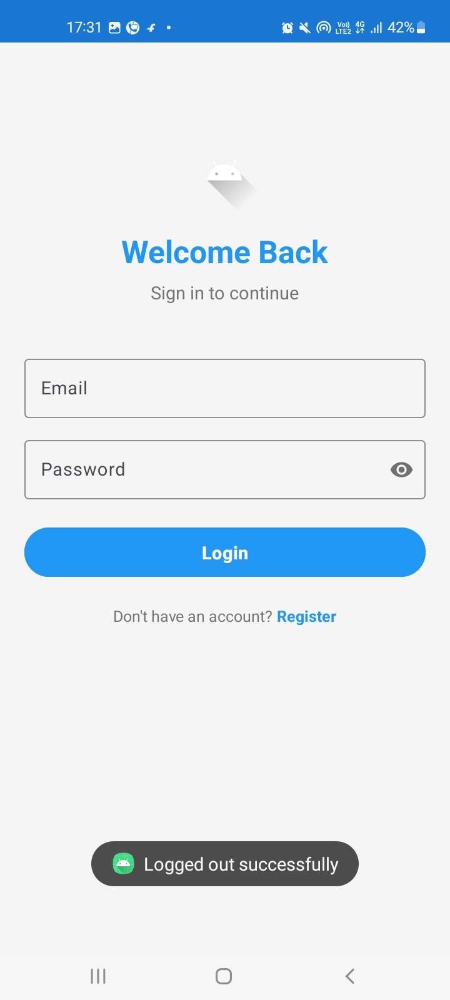
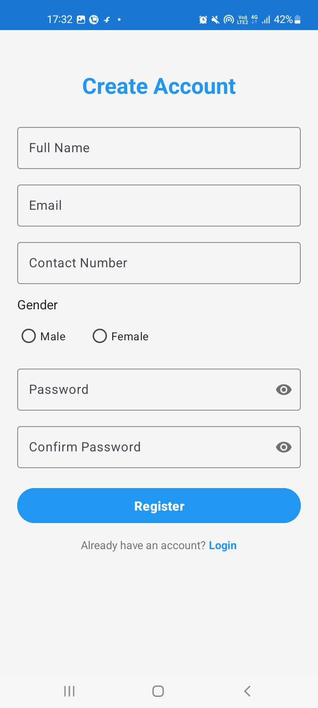

# 📱 ChaitanysTask - Course Management App

A modern Android application built with Kotlin for managing online courses. Features user authentication, course browsing, detailed course information, and a personal watchlist.

## 📥 Download APK

**Download the APK directly:** [app-debug.apk](app-debug.apk)

## 📸 Screenshots

### Login & Registration

*User login interface with clean design*

*User registration form*

### Main App Interface

*Main dashboard with course listings*

*Detailed course information view*

*Personal watchlist management*

## 🚀 Features

- **User Authentication**: Secure login and registration system
- **Course Management**: Browse and view detailed course information
- **Watchlist**: Save courses for later viewing
- **Modern UI**: Clean and intuitive Material Design interface
- **Navigation**: Drawer navigation with multiple sections
- **Data Persistence**: Local storage for user preferences and watchlist

## 🛠️ Technical Details

- **Language**: Kotlin
- **Architecture**: MVVM with Navigation Component
- **UI**: Material Design 3
- **Minimum SDK**: 24 (Android 7.0)
- **Target SDK**: 36 (Android 14)

## 👨‍💻 Developer

**Chaitany Skakde**
- GitHub: [@chaitanyskakde](https://github.com/chaitanyskakde)
